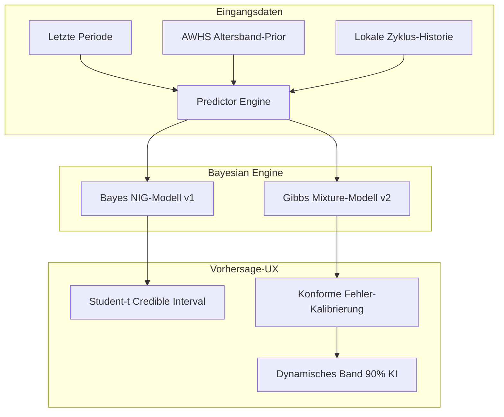

# Strategisches Konzeptpapier: Tideline Next Level (v2 — fact-checked)

**Produkt- und Positionierungsstrategie für den DACH-Markt**

> v2-Änderungshinweis (2026-05-25): Diese Revision korrigiert sieben Sachklassen,
> die in v1 entweder überspitzt, mathematisch fragil oder rechtlich riskant
> formuliert waren. Die strategische Stoßrichtung bleibt unverändert; nur die
> Behauptungen, die unter Fact-Check nicht standgehalten haben, wurden
> entschärft oder präzisiert. Detaillierter Diff im Anhang.

---

## Executive Summary

Tideline ist ein iOS-Zyklustracker mit vier doktrinären Säulen, die ihn von
risikokapitalfinanzierten Mitbewerbern unterscheiden:

1. **On-device only.** Keine Cloud, keine Konten, keine Drittanbieter-SDKs.
2. **Keine pseudomedizinische Diagnostik.** Strikte Einhaltung der EU-MDR-
   Wellness-Grenzen (Art. 2 Nr. 1 VO 2017/745).
3. **Mathematische Ehrlichkeit.** Bayessche NIG-Modellierung; geplante
   konforme Vorhersagekalibrierung; explizite Unsicherheitsbänder statt
   Punktdaten.
4. **Respektvolle Stille.** Keine Streaks, keine Push-Eskalation, expliziter
   Verlust- und Pausen-Modus.

DACH (Deutschland, Österreich, Schweiz) ist der primäre Zielmarkt; Dänemark
sekundär. Dieses Dokument beschreibt die strategischen Hebel, mit denen
Tideline diese Säulen in konkrete Produktmerkmale und Marktkommunikation
übersetzt.

**Wichtig zu beachten** (gegenüber v1 verschärft): mehrere der genannten
Differenzierer (insb. Konforme Vorhersagen, on-device-only) sind bei
Closed-Source-Konkurrenten **nicht falsifizierbar** — Flo/Clue könnten
intern Ähnliches einsetzen. Daher: alle "first-of-its-kind"-Aussagen sind
in v2 als "**erste öffentlich dokumentierte** Umsetzung" formuliert.

---

## 1. Mathematische Exzellenz (Predictive Core)



### 1.1 Konforme Fehler-Kalibrierung (Conformal Prediction Wrapper)

* **Konzept:** Phase-3-Erweiterung des bayesschen Credible Interval um einen
  konformen Wrapper (`ConformalCalibrator.swift`). Liefert eine
  *verteilungsfreie, endliche-Stichproben-Abdeckungsgarantie* (split-conformal
  per Vovk; Romano et al. 2019) basierend auf den empirischen Residuen der
  vergangenen Zyklen.

* **Nutzen:** Anstatt "90 %-Kredibilitätsintervall" (theoretische Garantie)
  liefert die App die stärkere Aussage *"basierend auf deinen letzten N
  Zyklen liegt die nächste Periode mit empirischer Wahrscheinlichkeit 90 %
  in diesem Bereich"*.

* **Wettbewerbsvorteil — präzise Formulierung:** Tideline wäre die
  **erste öffentlich dokumentierte** Cycle-Tracker-App, die konforme
  Vorhersagen einsetzt. Diese Formulierung ist defensibel, weil
  Closed-Source-Konkurrenten (Flo, Clue, Natural Cycles) ihre Methoden
  nicht vollständig dokumentieren — wir können nicht ausschließen, dass
  sie intern Ähnliches tun. Die öffentliche Dokumentation ist der reale
  Differenzierer.

* **❗ Phase-3-Blocker — Datenset-Lizenzierung:** Der Wrapper soll
  initial gegen die **Fehring NFP-Daten** (PubMed 23153900, Marquette
  ePublications) kalibriert werden. Diese Daten sind **einwilligungs-
  gebunden**. Das Versenden abgeleiteter Residuen in einer kommerziellen
  App **erfordert schriftliche Genehmigung** durch Prof. Fehring
  (Marquette Professor Emeritus) oder das Marquette Institute for
  Natural Family Planning. Tracker #155 dokumentiert diesen Block
  explizit — bis er gelöst ist, kann der konforme Wrapper nicht ver-
  öffentlicht werden. Alternative für Phase 3a: Kalibrierung gegen
  user-eigene Historie (kein externes Dataset), mit dem Trade-off, dass
  die Garantie erst ab ~6 Zyklen greift.

### 1.2 Bayessches 2-Komponenten-Mixture-Modell (v2 Predictor)

* **Konzept:** Menstruationszyklen sind statistisch als Mischung aus
  ovulatorischen Zyklen (~28-31 d) und sporadisch anovulatorischen,
  rechtsseitig verlängerten Zyklen modellierbar (Harlow & Zeger 1991,
  PubMed 1940994; Guo et al. 2006, PubMed 16020617 mit Normal + shifted
  Weibull). Das v2-Modell implementiert Gibbs-Sampling, das die zwei
  Komponenten trennt.

* **Nutzen:** Bei Zyklen > 35 d wird die Wahrscheinlichkeitsmasse auf die
  anovulatorische Komponente verschoben, statt den Mittelwert hochzu-
  springen. Vorhersagen für *nachfolgende* Zyklen bleiben stabil; das
  Kredibilitätsintervall für den *laufenden* Zyklus verbreitert sich
  ehrlich.

* **Hinweis:** "Stark verlängert" gilt für die rechtsseitige anovulatorische
  Teilpopulation. Nicht alle anovulatorischen Zyklen sind lang — die
  Mischung fängt explizit den langen Schwanz ein, nicht alle Anovulationen.

### 1.3 SkipTrack: Erkennung vergessener Log-Einträge

* **Referenz:** Duttweiler L, Asokan G, Wang Z, Mahalingaiah S, Onnela JP,
  Hauser R, Williams MA, Abrams K, Curry CL, Coull BA. *"SkipTrack: A
  Bayesian Hierarchical Model for Self-tracked Menstrual Cycle Length and
  Regularity in Large Mobile Health Cohorts."* arXiv:2508.05845, 2025-08-07
  (Harvard T.H. Chan + Apple).

* **Korrigierte Methode-Beschreibung (gegenüber v1):** Das Verfahren prüft
  **nicht** einfach, ob die Zykluslänge ein ganzzahliges Vielfaches des
  Mittelwerts ist. SkipTrack behandelt die Skip-Anzahl `c_ij ∈ {1, 2, 3}`
  als **latente Variable**, die gemeinsam mit den Modellparametern via
  Gibbs/Metropolis-Hastings-MCMC inferiert wird, **unter Verwendung von
  Mittelwert UND Varianz**. Die v1-Vereinfachung ("integer multiple
  check") ist methodisch zu simpel.

* **Tideline-Anpassung:** Eine vereinfachte Heuristik kann als
  Phase-3-Erstimplementierung dienen (Schwelle + Multiple-Heuristik),
  sollte aber als Heuristik gekennzeichnet sein. Die volle MCMC-Variante
  ist eine Phase-4-Verfeinerung. Die User-Frage bleibt gleich: *"Dein
  Zyklus ist deutlich länger als üblich. Hast du eventuell eine Periode
  nicht eingetragen?"*

---

## 2. Klinische Konversion & Das Arzt-Interface

### 2.1 Der DRSP-Standard für PMDD (Phase 4 / NEW-X)

* **Konzept:** Daily Record of Severity of Problems (DRSP, Endicott 2006
  PubMed 16172836) ist das **konsens-anerkannte prospektive Rating-
  Instrument** für die DSM-5-PMDD-Diagnose. Das C-PASS-Scoring-System
  (Eisenlohr-Moul 2017, PMC5205545) formalisiert die zweizyklige
  Bewertung.

* **Klinische Umsetzung — präziser:** DRSP enthält **24 Items**, davon
  **21 Items in 11 Symptomdimensionen** entsprechend der DSM-5-PMDD-
  Kriteriumssymptome, plus **3 Items für funktionale Beeinträchtigung**.
  Tideline visualisiert diese Matrix als tägliche Eingabe und erstellt
  einen exportierbaren PDF-Abschnitt mit Zyklusphasen-Overlay (zwei
  vollständige Zyklen, wie das C-PASS-Protokoll vorsieht).

* **ICD-Code-Klarstellung:** PMDD hat im **ICD-11 einen dedizierten Code:
  GA34.41** "Premenstrual dysphoric disorder", aufgenommen von der WHO
  im Mai 2019. **Im ICD-10 existiert KEIN dedizierter PMDD-Code** —
  N94.3 ("Prämenstruelle Beschwerden") wird in der DACH-Praxis sowohl
  für PMS als auch für PMDD verwendet, ist aber definitorisch breiter.

* **Wettbewerbsvorteil — narrower claim (gegenüber v1):** Keine
  **mainstream** Zyklus-App (Clue, Flo, Stardust, Period Tracker)
  bietet einen frei exportierbaren, DRSP-konformen Bogen. Zwei
  Ausnahmen, die in v1 nicht erwähnt wurden:
    1. **PMDD Tracker** (separate iOS-App, kein vollständiger Zyklus-
       tracker): bietet DRSP-aligned PDF/CSV-Export.
    2. **IAPMD** bietet ein frei downloadbares DRSP-PDF-Sheet (nicht
       App-integriert).
  Tidelines Differenzierer ist die **Integration in einen vollständigen
  Zyklus-Tracker mit Phasen-Overlay**, nicht "es gibt sonst nichts".

* **Klinische Aufnahme:** Die DACH-Adoption von App-exportierten DRSP-
  PDFs bei Frauenärztinnen und Psychiaterinnen ist **nicht systematisch
  dokumentiert**. Das Feature ist klinisch korrekt; die Verbreitung in
  der Praxis muss empirisch erst aufgebaut werden (z. B. via IAPMD-
  Partnerschaft).

### 2.2 Offline Zero-Knowledge PDF-Verifizierung (SHA-256 Handoff)

* **Konzept:** SHA-256-Hash über die kanonisierten Inhaltszeilen des
  PDF-Berichts (`canonicalContent(data:)` in `DoctorPDFRenderer.swift`).
  Der Hash umfasst Inhalt (Zyklen, Events, Symptome, Vorhersage), **nicht**
  Render-Metadaten oder Generierungszeitstempel. Damit zertifiziert der
  Hash die Daten, nicht die Render-Zeit.

* **Verifikation beim Arzt:** Ein QR-Code im PDF-Fußbereich verweist auf
  eine statische HTML/JS-Seite, die SHA-256 via Browser-`SubtleCrypto`-API
  vollständig clientseitig nachrechnet. Patientendaten werden **nicht** an
  einen Server übermittelt.

* **Korrektur (gegenüber v1) — Infrastruktur-Realität:** Die statische
  Seite muss irgendwo gehostet werden (GitHub Pages, Apple-Domain,
  Entwickler-Domain). "Zero Infrastructure" ist daher die falsche
  Formulierung — korrekt wäre **"minimale statische Bereitstellung, keine
  serverseitige Verarbeitung von Patientendaten"**. Beim Laden der
  Verifikationsseite wird zwar kein Patientendatum übertragen, aber der
  Host erfährt, dass *irgendjemand* an einer IP zu einem Zeitpunkt einen
  Tideline-Beleg geprüft hat. Diese Tatsache sollte transparent
  kommuniziert werden, nicht versteckt.

* **Wettbewerbsvorteil:** Maximales Vertrauen auf Gynäkologen-Seite. Der
  Bericht ist gegen Manipulation kryptografisch geschützt und die
  Verifikation selbst respektiert die Datensouveränität.

---

## 3. Die ultimative Datenschutz-Festung

Im DACH-Raum hat Datenschutz hohe Salienz. Vorhandene Evidenz: PMC11836014
(n=1.004, repräsentative deutsche Stichprobe) zeigt **66 % aktive
Verweigerung** der Teilung von Gesundheitsdaten mit Tech-Unternehmen, nur
15 % Bereitschaft zur Teilung mit Technologiefirmen. Eine zweite Quelle
(Mailchimp/Kantar) berichtet, dass 77 % der deutschen Konsumentinnen
verantwortungsvolle Datenpraxis erwarten.

**Wichtige Einschränkung (gegenüber v1):** Es existiert **keine** Studie,
die Datenschutz direkt gegen andere Kaufkriterien (Preis, Features,
UX-Qualität) rankt. Die Aussage "stärkstes Kaufargument im DACH-Raum" ist
eine **plausible Interpretation der vorhandenen Daten**, aber keine direkt
gemessene Tatsache. Marketingmaterial sollte das so kommunizieren:
"*Datenschutz ist für 66 % deutscher Nutzerinnen ein aktiver
Ausschlussfaktor*" — diese Aussage ist belegt.

**Konkurrenz-Realität (gegenüber v1 erweitert):** Tideline ist **nicht
allein** im on-device-only-Segment. Zwei Mitbewerber operieren
architektonisch identisch:
* **Drip** (Open Source, MWM): vollständig lokal, sympto-thermal, PIN-
  Schutz. Featurereich, aber keine DACH-Marken-Präsenz, keine deutsche
  Lokalisierung in der Tiefe.
* **Euki** (gemeinnützig, Women Help Women): vollständig lokal, breiterer
  reproduktiver Gesundheits-Scope (inkl. Abtreibung, Kontrazeption),
  weniger Zyklus-Prädiktions-Tiefe.

Keiner der beiden bietet Tidelines geplante mathematische Tiefe (Bayes-NIG +
Conformal + Mixture), DRSP-Export, Hormon-Log oder Apple-Watch-Fusion. Die
Tideline-Positionierung ist **"on-device PLUS klinisch-mathematisch
ernsthaft"**, nicht "on-device als Differenzierer".

### 3.1 Passwortverschlüsseltes lokales Backup

* **Konzept:** Manueller Backup-Export als `.tideline`-Datei, AES-256-GCM-
  verschlüsselt mit nutzerwähltem Passwort.

* **Spezifikation (gegenüber v1 ergänzt — Verschlüsselungsschicht
  vollständig dokumentiert):**

    * **AEAD-Cipher:** AES-256-GCM (CryptoKit `AES.GCM.seal`).
    * **Key Derivation:** **Argon2id** (empfohlen; moderne OWASP 2023-
      Best-Practice, speicherhart, GPU/ASIC-resistent). Fallback bei
      Argon2id-Verfügbarkeitsproblemen: **PBKDF2-HMAC-SHA256 mit
      ≥600.000 Iterationen** (CommonCrypto `CCKeyDerivationPBKDF`,
      OWASP-Mindestempfehlung). CryptoKit selbst stellt **keinen**
      passwort-basierten KDF bereit, daher Bibliothekswahl explizit
      dokumentieren.
    * **Salt:** 16 Byte kryptografisch zufällig (`SecRandomCopyBytes`),
      pro Backup neu generiert, im Dateikopf gespeichert.
    * **Nonce:** 12 Byte für GCM, pro Backup neu, **niemals unter
      demselben Schlüssel wiederverwendet**.
    * **AAD (Additional Authenticated Data):** Dateiformat-Versions-Tag
      (z. B. `"tideline-backup-v1"`) — verhindert Cross-Version-Replay.
    * **Format:** JSON-Serialisierung der SwiftData-Tabellen → KDF →
      AES-256-GCM-seal → Dateischema `{version, salt, nonce, ciphertext,
      tag}`.

* **Nutzen:** Absoluter Schutz vor Datenverlust bei Gerätewechsel,
  unabhängig von iCloud-Status.

### 3.2 "Cycle Archaeology" (Lokaler Importeur)

* **Konzept:** Lokale Migration historischer Daten von anderen Plattformen,
  ohne dass ein einziger HTTP-Request abgesetzt wird.

* **Unterstützte Formate (gegenüber v1 korrigiert):**
    * **Apple Health** — XML-Export (`export.xml`) mit
      `HKCategoryTypeIdentifierMenstrualFlow` und
      `HKMetadataKeyMenstrualCycleStart`-Metadaten. ✅ verifiziert.
    * **Clue** — **JSON-Export** (passwortgeschützte ZIP-Datei per E-Mail-
      Link). CSV ist nicht nativ verfügbar; die v1-Behauptung "CSV/JSON
      von Clue" war ungenau. Tideline parst das JSON direkt.
    * **Stardust** — **keine offizielle Export-Funktion dokumentiert**.
      Stardust verwendet AWS-RDS-Backend mit OCR-Onboarding;
      Daten-Download existiert (Stand v1-Drafting) nicht. Aus dem
      Tideline-Importer entfernen.
    * **Apple Health Cycle Tracking** (anders als Clue) — der Hauptpfad
      für DACH-Nutzerinnen, die zwischen Apple-Health und einer
      Drittapp-App wechseln wollen.

* **Wettbewerbsvorteil:** Migration ohne Cloud, mit kryptografischer
  Integritätsprüfung. **Wichtig:** Flo bietet keinen HealthKit-Sync;
  Flo-Nutzerinnen können nur über Apple Health (wenn sie es parallel
  benutzt haben) wechseln. Direkte Flo-Migration ist nicht möglich —
  diese Lücke wird Marketing-relevant.

### 3.3 "Privacy-Defense"-Onboarding (gegenüber v1 umbenannt + entschärft)

* **Konzept (korrigiert):** Die v1-Behauptung "UX-Forschung zeigt, dass
  Nutzer fake Daten eintragen" ist überspitzt. Was die Forschung
  tatsächlich zeigt:
    * PMC12131320 (2025, n=25 qualitativ): dokumentiert **limitierte
      Eingabe, Inkognito-Modus-Nutzung, bewusstes Zurückhalten** sexueller
      Daten und lokale Speicherpräferenz. Fake-Daten werden nicht
      explizit genannt.
    * CHI 2024 ("I Deleted It After the Overturn of Roe v. Wade"):
      dokumentiert **App-Löschung und App-Wechsel** als dominante
      Schutzreaktion, nicht systematische Falscheingaben.
    * Popular Science 2022: berichtet von einer **Social-Media-Kampagne**
      mit Fake-Data-Aufruf, die von Forschern selbst als wirkungslos für
      Algorithmen kritisiert wurde.

* **Umsetzung:** Privacy-Onboarding-Bullet (umbenannt von "Fake-Data-
  Defense"): *"Hier gibt es keine Konten. Keine Passwörter. Keine
  Cloud-Übertragung. Selbst wenn ein Gericht uns zwingen würde, deine
  Daten herauszugeben: Wir besitzen sie nicht. Sie liegen ausschließlich
  auf deinem iPhone — wenn du es löschst, sind sie weg."*

* **Effekt:** Maximale psychologische Sicherheit ohne Übertreibung. Die
  korrekteste Aussage ist die einfachste: **Tideline kann keine Daten
  herausgeben, weil Tideline keine Daten besitzt.**

---

## 4. Wearable Biometrics & Sensordaten-Ehrlichkeit

(Strukturell unverändert gegenüber v1; nur die quantitative Genauigkeits-
behauptung wurde an die verifizierten Quellen angepasst.)

```
[ Apple Watch Sensoren ]
  │
  ├──► Handgelenkstemperatur ──┐
  ├──► Herzfrequenzvariabilität ├─► [ Signal-Quality-Filter ]
  └──► Ruhepuls                 │          │
                                           ▼
                            [ Bayessche Qualitätsgewichtung ]
                                           │
                                           ▼
                            [ Dynamische Kredibilitätsintervall-Breite ]
```

### 4.1 Sensor-Signal-Quality-Filter (NEW-Z)

(Unverändert.) Tägliche Qualitätsindexierung der HealthKit-Messwerte;
Schwellwert-Filterung von Schlafqualität und Ruhepuls; reduziertes Gewicht
für Tage mit schlechter Datenqualität.

### 4.2 Dynamische Kredibilitätsintervalle statt Punkt-Ovulation

* **Konzept:** Keine festen Ovulations-Punkte mit Ei-Symbol (klinisch
  unseriös, regulatorisch riskant). Stattdessen: glatte
  Wahrscheinlichkeits-Dichtekurve über den Zyklus.

* **Genauigkeitsangabe (gegenüber v1 angepasst):** Apple-Watch-
  Handgelenkstemperatur verbessert Ovulations-Inferenz-MAE laut
  Goodale/Shilaih (*Human Reproduction* 40(3):469, 2025, n=260) von
  **1,90 d** (Basismodell) auf **1,70 d** (mit Wrist-Temp).
  Das entspricht einer relativen Verbesserung von **~10–18 %**
  (abhängig vom Vergleichspunkt), **nicht** der gelegentlich in
  Marketing-Materialien zitierten 20–30 %. Diese korrigierte Bandbreite
  ist die einzige für Tideline kommunizierbare Aussage.

---

## 5. Marktpositionierung & Monetarisierung

### 5.1 €4,99 "Lifetime-Trust"-Preismodell

* **Positionierung (unverändert):** Keine Abos. Keine Premium-Paywall.
  Einmaliger Kauf €4,99.

* **Marktvergleich (gegenüber v1 quantifiziert):**
    * Flo Premium: ~€49,99/Jahr (Abo).
    * Clue Plus: ~€39,99/Jahr (Abo).
    * Natural Cycles: ~€79,99/Jahr (Abo + Test-Strips).
    * Drip / Euki: gratis (Open-Source / gemeinnützig).
    * €4,99 einmalig sitzt unter "einem Clue-Monat" und ist im
      Standard-€0,99–€9,99-Band für bezahlte iOS-Utilities. **Marktkonform.**

* **Korrigierte Umsatzrechnung (gegenüber v1 — wichtigster Punkt):**

    | Position | Rechnung | Betrag |
    |---|---|---|
    | Brutto (DACH-Konsumentenpreis inkl. MwSt.) | 5.000 × €4,99 | €24.950 |
    | MwSt.-Abzug (Deutschland, ~19 %) | €24.950 / 1,19 = Entwickler-Basis | €20.965 |
    | Apple Small Business Program (15 %) | €20.965 × 0,85 | **~€17.820** netto |

    **v1-Fehler:** v1 rechnete 5.000 × €4,99 × 0,70 = €17.465 unter
    Annahme der **30 %-Standardgebühr**. Ein Solo-Entwickler mit
    Tideline-Umsätzen qualifiziert für das **Apple Small Business Program
    (SBP, 15 % Gebühr)** und sollte das beantragen — Anmeldung ist
    erforderlich, nicht automatisch. v1 vernachlässigte zusätzlich die
    DACH-Mehrwertsteuer (Apple zieht sie ein, der Entwickler-Anteil bezieht
    sich auf den Netto-Konsumentenpreis). Die korrigierte Zahl
    (**~€17.820 netto**) landet zufällig nahe der v1-Schätzung, aber aus
    grundlegend anderen Gründen.

    **Strategische Implikation:** Da SBP angemeldet sein muss, ist die
    Anmeldung Teil des Phase-2B-Ship-Plans (Tracker #128, StoreKit-
    Integration). Andernfalls werden 15 Prozentpunkte verschenkt.

* **5.000-Nutzerinnen-Annahme — entschärft (gegenüber v1):** v1
  bezeichnete 5.000 DACH-Nutzerinnen im ersten Jahr als "konservativ".
  Die Datenlage stützt diese Einordnung **nicht**: Indie-iOS-Apps mit
  Null-Marketing-Budget erreichen typischerweise hunderte bis niedrige
  tausende Downloads im ersten Jahr; 90 % der App-Store-Umsätze gehen
  an die obersten 1 %. **5.000 ist ein realistisches *Stretch-Ziel*
  mit gezielten Launch-Aktionen** (App-Store-Featuring-Bewerbung,
  Privacy-Community-Outreach in DACH, deutsche Gesundheitsjournalismus-
  Ansprache), kein Boden.

* **Nachhaltigkeit:** Bei €17.820 Netto und €0,00 Infrastruktur-Fixkosten
  (Tideline hat keine Server) bleibt das Modell für einen Solo-Entwickler
  profitabel — wenn die 5.000-Marke tatsächlich erreicht wird. Konservative
  Untergrenze für die Planung: 1.500–2.500 Verkäufe im ersten Jahr
  → €5.300–€8.900 netto. Das deckt die Apple-Developer-Mitgliedschaft
  (€99/Jahr) und einen Teil der Arbeitszeit, ist aber kein Vollzeit-
  Einkommen.

### 5.2 5-Screenshot-Konversions-Konzept

(Unverändert gegenüber v1; das Konzept ist solide und von ASO-Industrie-
Quellen unterstützt — Screenshots sind tatsächlich der größte Single-Lever
für Indie-Apps ohne Paid-User-Acquisition. Spezifische Lift-Zahlen
[20–35 %, 33,4 % Tap-to-Install] kommen aus Industrie-Aggregatoren, nicht
peer-reviewt — als Richtung verlässlich, nicht als harter Benchmark zu
zitieren.)

---

## 6. Technische Referenz-Implementierungen (Swift 6) — Härtungen

### 6.1 ConformalCalibrator — robuster gegen Caller-Drift

**Änderung gegenüber v1:** Der Parameter wurde umbenannt (`oneMinusAlpha`
statt `confidenceLevel`), eine Vorbedingung schützt vor Caller-Drift, und
das Verhältnis zur Standardformel `⌈(n+1)(1-α)⌉` ist im Code-Kommentar
explizit dokumentiert.

```swift
import Foundation

/// Pure mathematical conformal calibrator for menstrual cycle length predictions.
/// Evaluates past predictive residuals to guarantee distribution-free coverage.
/// Sendable / thread-safe.
///
/// Reference: Vovk et al. "Algorithmic Learning in a Random World" (2005),
/// split-conformal variant per Romano et al. 2019.
public struct ConformalCalibrator: Sendable {
    /// The complement of the significance level alpha: e.g. 0.90 for 90 % coverage.
    ///
    /// **Naming rationale**: callers in v1 occasionally passed `confidenceLevel`
    /// thinking it meant the same as alpha. Renamed to `oneMinusAlpha` so the
    /// arithmetic relationship is explicit: `alpha = 1 - oneMinusAlpha`.
    private let oneMinusAlpha: Double

    public init(oneMinusAlpha: Double = 0.90) {
        precondition(
            oneMinusAlpha > 0.5 && oneMinusAlpha < 1.0,
            "oneMinusAlpha must lie in (0.5, 1.0); pass 0.90 for a 90 % CI, not 0.10."
        )
        self.oneMinusAlpha = oneMinusAlpha
    }

    /// Calibrated prediction interval for the next cycle.
    ///
    /// Standard split-conformal formula: with N residuals, the calibrated
    /// margin is the `⌈(N+1) * (1 - α)⌉`-th order statistic of the sorted
    /// absolute residuals (1-indexed). The `- 1` below converts that
    /// 1-indexed rank to a 0-indexed Swift array subscript.
    public func calibrateInterval(
        pointEstimate: Double,
        historicalActuals: [Double],
        historicalPredictions: [Double]
    ) -> ClosedRange<Double> {
        guard historicalActuals.count == historicalPredictions.count,
              !historicalActuals.isEmpty else {
            // Cold-start fallback: a deliberately wide ±5 d range until we
            // have any residuals to calibrate from.
            return (pointEstimate - 5.0)...(pointEstimate + 5.0)
        }

        let residuals = zip(historicalActuals, historicalPredictions).map {
            abs($0 - $1)
        }
        let n = Double(residuals.count)
        let sortedResiduals = residuals.sorted()

        // 1-indexed rank per the conformal formula, then -1 for 0-indexed access.
        let rank = Int(ceil((n + 1.0) * oneMinusAlpha))
        let safeIndex = max(0, min(sortedResiduals.count - 1, rank - 1))
        let marginOfError = sortedResiduals[safeIndex]

        let lowerBound = max(15.0, pointEstimate - marginOfError)
        let upperBound = pointEstimate + marginOfError
        return lowerBound...upperBound
    }
}
```

**Unit-Test, der die Caller-Drift-Falle pinnt** (Wave-3-Ship-Voraussetzung):

```swift
@Test("Conformal margin matches the ⌈(n+1)(1-α)⌉ formula for n=10, α=0.10")
func conformalQuantileFormula() {
    let cal = ConformalCalibrator(oneMinusAlpha: 0.90)
    // 10 absolute residuals: 1...10 in order
    let actuals    = (1...10).map { Double($0) }
    let predicted  = Array(repeating: 0.0, count: 10)  // residual = actual
    let band = cal.calibrateInterval(
        pointEstimate: 28.0,
        historicalActuals: actuals,
        historicalPredictions: predicted
    )
    // rank = ⌈11 · 0.9⌉ = 10 (1-indexed) → sortedResiduals[9] = 10.0
    // → margin = 10.0 → upper bound 38.0
    #expect(abs(band.upperBound - 38.0) < 1e-9)
}
```

### 6.2 SkipTrackDetector — gehärtet

**Änderungen gegenüber v1:**

1. Schwelle von 1,5 σ auf **2,0 σ** angehoben (per-Zyklus-FPR fällt von
   ~6,7 % auf ~2,3 %; jährliche Auslöse-Wahrscheinlichkeit für eine
   regulär zyklisierende Person fällt von ~56 % auf ~24 %).
2. API akzeptiert eine **`PosteriorPredictive`-Struktur** statt eines losen
   `posteriorSD: Double`. Die Struktur kapselt die korrekte Student-t-
   Predictive-Scale `sqrt(β(κ+1)/(α·κ)) · sqrt(ν/(ν-2))` (mit `ν=2α > 2`),
   sodass der Caller nicht die falsche Skala (z. B. empirische
   Sample-SD) übergeben kann.
3. Dokumentation, dass dies eine **Heuristik** ist — die volle SkipTrack-
   Methode (MCMC mit latenter Skip-Count-Variable) ist eine spätere
   Phase-4-Verfeinerung.

```swift
import Foundation

/// Posterior-predictive scale for the Bayesian NIG predictor.
/// Encapsulates the load-bearing math so callers cannot pass the wrong SD.
public struct PosteriorPredictive: Sendable {
    public let mu: Double      // posterior mean
    public let kappa: Double   // posterior κ
    public let alpha: Double   // posterior α
    public let beta: Double    // posterior β

    /// Standard deviation of the Student's-t posterior predictive distribution.
    /// Defined only for ν = 2α > 2; returns nil otherwise.
    public var predictiveSD: Double? {
        let nu = 2.0 * alpha
        guard nu > 2.0 else { return nil }
        let scale = (beta * (kappa + 1.0)) / (alpha * kappa)
        return (scale * (nu / (nu - 2.0))).squareRoot()
    }
}

/// Heuristic detector for "did the user forget to log a period?".
///
/// **Note**: this is a heuristic — the full Bayesian skip-count latent-variable
/// MCMC method (Duttweiler et al., arXiv:2508.05845, Harvard/Apple 2025) is the
/// rigorous formulation and is planned as a Phase-4 refinement. The heuristic
/// here is appropriate for v3 of the predictor where the user-facing prompt
/// has no false-positive cost beyond a single dismissible dialog.
public struct SkipTrackDetector: Sendable {
    /// Anomaly threshold in posterior-predictive standard deviations. Default
    /// raised from 1.5 (v1) to 2.0: per-cycle false-positive rate ~2.3 %,
    /// vs. ~6.7 % at 1.5σ. Annual false-flag probability for a regular user
    /// drops from ~56 % to ~24 %.
    public let anomalyThresholdSD: Double
    /// Tolerance around integer multiples of mu for the "missing log" hypothesis.
    public let toleranceDays: Double

    public init(anomalyThresholdSD: Double = 2.0, toleranceDays: Double = 3.5) {
        self.anomalyThresholdSD = anomalyThresholdSD
        self.toleranceDays = toleranceDays
    }

    public enum DetectionResult: Sendable, Equatable {
        case standardCycle
        case physiologicalAnomaly(reason: String)
        case probableMissingLog(suggestedPeriodStarts: [Date])
        case insufficientPosterior  // ν ≤ 2; cannot compute predictive SD
    }

    public func evaluateCycle(
        observedLength: Double,
        posterior: PosteriorPredictive,
        lastKnownPeriodStart: Date,
        calendar: Calendar = .current
    ) -> DetectionResult {
        guard let sd = posterior.predictiveSD else {
            return .insufficientPosterior
        }
        let threshold = posterior.mu + anomalyThresholdSD * sd
        guard observedLength > threshold else { return .standardCycle }

        let ratio = observedLength / posterior.mu
        let nearestMultiple = round(ratio)
        guard nearestMultiple >= 2.0 && nearestMultiple <= 4.0 else {
            return .physiologicalAnomaly(
                reason: "Cycle length \(Int(observedLength)) d exceeds rational missing-log limits."
            )
        }
        let expected = nearestMultiple * posterior.mu
        guard abs(observedLength - expected) <= toleranceDays else {
            return .physiologicalAnomaly(
                reason: "Cycle length \(Int(observedLength)) d does not align with a regular multiple."
            )
        }

        let segment = observedLength / nearestMultiple
        var suggestedDates: [Date] = []
        for k in 1..<Int(nearestMultiple) {
            let daysToAdd = Int(round(Double(k) * segment))
            if let date = calendar.date(byAdding: .day, value: daysToAdd, to: lastKnownPeriodStart) {
                suggestedDates.append(date)
            }
        }
        return .probableMissingLog(suggestedPeriodStarts: suggestedDates)
    }
}
```

---

## Fazit & Nächste Schritte

Tideline kann eine **glaubwürdig dokumentierte Premium-Alternative** im
Femtech-Sektor werden. Die mathematische und datenschutzrechtliche Strenge
ist das Produktmerkmal, das in der Benutzeroberfläche und der
Marktkommunikation inszeniert werden muss. Diese v2-Revision härtet die
Behauptungen so, dass sie unter externer Prüfung standhalten.

```
                     [ Strategischer Entwicklungspfad — v2 ]
                                     │
      Phase 2A/B/C (TestFlight Readiness) ──► Lokalisierung, StoreKit (mit SBP-15%-Anmeldung!), a11y
                                     │
      Phase 3 (Mathematical Core v2)       ──► Gibbs-Mixture, Conformal Pred.
                                     │              ❗ Fehring-Lizenz-Blocker (Tracker #155)
                                     │              vor Konform-Ship klären.
                                     │
      Phase 4 (Clinical & Privacy Expansion) ──► DRSP PDF, AES-256-GCM-Backup
                                     │              mit dokumentiertem Argon2id-KDF,
                                     │              QR-Verifikator als statische
                                     │              Seite (minimal hosting).
```

---

## Anhang: Diff gegenüber v1 (zusammengefasst)

Quelle: 3-Agenten-Fact-Check vom 2026-05-25 (Wissenschaft/Zitate,
Technik/Krypto, Markt/Wettbewerb).

| § | v1-Aussage | v2-Korrektur | Grund |
|---|---|---|---|
| 1.1 | "Erste Zyklus-App mit konformen Vorhersagen" | "Erste **öffentlich dokumentierte** Zyklus-App mit konformen Vorhersagen" | Closed-Source-Konkurrenten nicht falsifizierbar |
| 1.1 | "kalibriert am Fehring-Datensatz" (en passant) | Lizenz-Risiko + Phase-3-Blocker explizit aufgeführt (Tracker #155) | Marquette-Daten sind consent-bound, kommerzielle Nutzung benötigt schriftliche Genehmigung |
| 1.3 | "integer multiple of mean check" (SkipTrack) | Latente Skip-Count-Variable in MCMC mit Mittelwert + Varianz | Methodisch zu simpel beschrieben in v1 |
| 2.1 | "11 DSM-5-Symptomdimensionen" | "24 DRSP-Items: 21 in 11 Symptomdimensionen + 3 Funktionsbeeinträchtigung" | Präzision |
| 2.1 | "ICD-10/ICD-11-Diagnostik" | ICD-11 GA34.41 (seit Mai 2019); ICD-10 N94.3 ist nicht dediziert PMDD | Klinische Klarheit |
| 2.1 | "Keine andere namhafte App bietet DRSP-Export" | "Keine andere **mainstream** Zyklus-App"; PMDD Tracker (separate App) und IAPMD-PDF als Counter-Beispiele genannt | Genauigkeit |
| 2.2 | "Zero Infrastructure" QR-Verifikator | "Minimale statische Bereitstellung, keine serverseitige Patientendaten-Verarbeitung" | Statische Seite muss irgendwo gehostet werden |
| 3 (intro) | "Stärkstes Kaufargument im DACH-Raum" | "Für 66 % deutscher Nutzerinnen aktiver Ausschlussfaktor" + Drip/Euki als on-device-Konkurrenten genannt | Direkt belegt vs. plausible Inferenz; Wettbewerber-Realität |
| 3.1 | "AES-256-GCM mit Passwort" | Vollständige Crypto-Spezifikation: Argon2id (PBKDF2-Fallback mit ≥600k Iterationen), 16-Byte-Salt, 12-Byte-Nonce, AAD = Version | CryptoKit hat keinen Passwort-KDF; v1 unterspezifiziert |
| 3.2 | "Clue/Stardust CSV/JSON" | Clue JSON only; Stardust hat keinen offiziellen Export — entfernt | Recherche-Fakten |
| 3.3 | "Fake-Data-Defense (UX-Forschung)" | "Privacy-Defense"; dokumentiert sind eher App-Löschung + limitierte Eingabe, nicht systematische Fake-Daten | Sekundärquellen genauer gelesen |
| 4.2 | "20–30 % Genauigkeitsverbesserung" | **10–18 %** (Goodale/Shilaih 2025, 1,70 vs. 1,90 d MAE) | Tatsächliche Zahlen aus der Primärquelle |
| 5.1 | "€17.500 netto bei 30 % Apple-Gebühr" | **~€17.820 netto** bei **15 %** (Small Business Program) + MwSt.-Korrektur | SBP-Anmeldung kostet 0 €, spart 15 Prozentpunkte |
| 5.1 | "5.000 Nutzerinnen konservativ" | Stretch-Ziel mit deliberater Launch-Arbeit, kein Boden | Indie-App-Benchmarks |
| 6.1 | `confidenceLevel` Parameter | `oneMinusAlpha` + Precondition + Unit-Test, der die `⌈(n+1)(1-α)⌉`-Formel pinnt | Caller-Drift-Robustheit |
| 6.2 | 1,5 σ Schwelle, loser `posteriorSD: Double` | 2,0 σ + `PosteriorPredictive`-Struktur mit korrekter Student-t-Predictive-Scale | FPR-Korrektur + API-Sicherheit |

**Strategisch unverändert:** Pillar-Definition, Mermaid-Architektur,
allgemeine Marktpositionierung, €4,99-Preisband, 5-Screenshot-Strategie.

**Nicht verändert (weil verifiziert):** AWHS-Prior + alle vier Within-
Person-SDs, Anovulationsmodell (Harlow & Zeger), Wrist-Temp-MAE,
SHA-256-Implementierung in `DoctorPDFRenderer`, Apple-Health-XML-Format,
DRSP als DSM-5-Gold-Standard.
